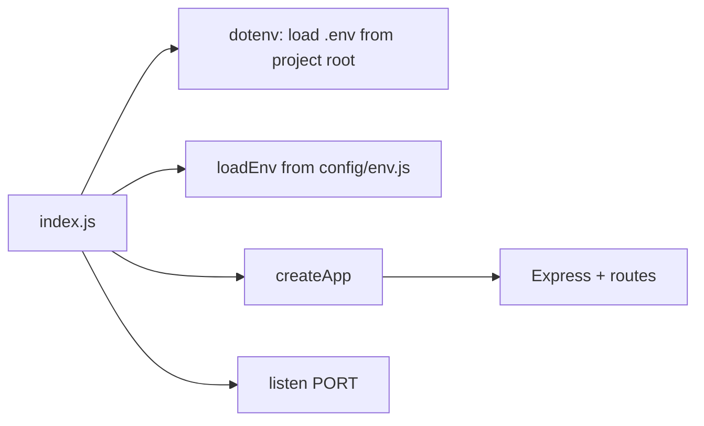
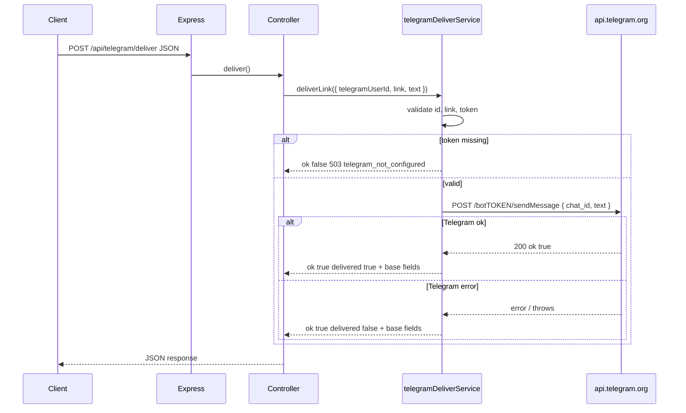

# Technical guide: Telegram link delivery service

This document explains **how the backend works end-to-end**: startup, request flow, both delivery modes, validation, responses, errors, and supporting scripts. It is intended for engineers onboarding to the codebase or integrating a client.

---

## 1. What the service does

The service exposes a small **HTTP JSON API** that:

1. Accepts a **recipient** on Telegram, a **URL** (`link`), and optional **intro text**.
2. Builds a single **plain-text DM** body: intro line, blank line, then the URL.
3. Attempts to **send** that DM via either:
   - **Telegram Bot HTTP API** (`sendMessage`), or  
   - **MTProto** (GramJS user client + saved session string).
4. Returns a JSON body that **always includes the same `link`** (and sometimes a **`telegramAppDeepLink`** derived from `t.me` URLs) so a game client can **display or copy** the URL when Telegram delivery fails (e.g. in-app browser restrictions).

There is **no database**, **no caller authentication**, and **no queue**—each request performs a synchronous send attempt (POC scope).

---

## 2. Process startup



1. **`index.js`** (project root) loads **`.env`** via **dotenv**, calls **`loadEnv()`** from `src/config/env.js`, **`createApp`**, then **`listen`** on **`PORT`**.
2. **`createApp(env)`** in `src/app.js` builds Express: CORS, JSON body parser (100 kb cap), creates **two service factories** with the same `env`, mounts the root router, then 404 and global error handlers.
3. The HTTP server listens on **`env.port`** (default **4000** from `PORT`).

**Important:** Environment variables must be present **before** `loadEnv()` runs. Missing bot token or MTProto fields is detected per-request, not at startup (except implicit empty strings).

---

## 3. Repository layout (relevant files)

| Path | Responsibility |
|------|----------------|
| `index.js` | Entry: dotenv, `loadEnv`, `createApp`, `listen`. |
| `src/app.js` | Express app wiring, service construction, error middleware. |
| `src/config/env.js` | Maps `process.env` → `AppEnv`. |
| `src/config/env.types.js` | JSDoc typedef for `AppEnv`. |
| `src/middleware/cors.middleware.js` | CORS + OPTIONS 204; optional `CORS_ORIGIN`. |
| `src/routes/index.js` | Mounts health + `/api/telegram/*`. |
| `src/routes/health.routes.js` | `GET /`, `GET /health`. |
| `src/routes/telegramDeliver.routes.js` | `POST .../deliver`, `POST .../deliver-mtproto`. |
| `src/controllers/telegramDeliver.controller.js` | Bot path: body → service → JSON. |
| `src/controllers/mtprotoDeliver.controller.js` | MTProto path: body → service → JSON. |
| `src/services/telegramDeliverService.js` | Bot delivery orchestration. |
| `src/services/mtprotoDeliverService.js` | MTProto delivery (account pool, retries, idempotency). |
| `src/config/mtprotoAccounts.js` | Loads `config/mtproto-accounts.json` (or env JSON / `TELEGRAM_MTPROTO_ACCOUNTS_FILE`). |
| `config/mtproto-accounts.json` | MTProto session list (`id` + `session` per Telegram user account). |
| `src/services/telegramClient.js` | `sendMessage` via HTTPS; `tg://` deep-link helper. |
| `scripts/mtproto-login.mjs` | Interactive login; prints session string for `config/mtproto-accounts.json`. |

---

## 4. HTTP API reference

Base URL: `http://<host>:<PORT>/` (default port **4000**).

### 4.1 `GET /`

Returns plain text: short service label.

### 4.2 `GET /health`

Returns JSON: `{ "ok": true }` for liveness.

### 4.3 `POST /api/telegram/deliver` (Bot API)

**Headers:** `Content-Type: application/json`

**Body fields**

| Field | Type | Required | Description |
|--------|------|----------|-------------|
| `telegramUserId` | string | Yes | Digits only; Telegram user id used as `chat_id` for `sendMessage`. |
| `link` | string | Yes | Non-empty after trim; embedded in DM and echoed in response. |
| `text` | string | No | Intro line above the URL. Default: `Here is your link.` |

**Configuration:** `TELEGRAM_BOT_TOKEN` must be non-empty.

**Success (HTTP 200)** — Telegram accepted the message:

```json
{
  "ok": true,
  "delivered": true,
  "link": "<same as request>",
  "telegramAppDeepLink": "<optional; only if link parses as https://t.me/... or telegram.me>",
  "message": "<human-readable guidance for clients>"
}
```

**Partial success (HTTP 200)** — Request valid but `sendMessage` threw (blocked bot, user never started bot, bad id, network, etc.):

```json
{
  "ok": true,
  "delivered": false,
  "link": "<same as request>",
  "telegramAppDeepLink": "<optional>",
  "message": "<includes note to show URL in UI>"
}
```

**Client errors**

| HTTP | `error` | When |
|------|---------|------|
| 400 | `invalid_telegram_user_id` | Not all digits or not a positive bigint. |
| 400 | `missing_link` | Missing or whitespace-only `link`. |
| 503 | `telegram_not_configured` | `TELEGRAM_BOT_TOKEN` empty. |

### 4.4 `POST /api/telegram/deliver-mtproto` (GramJS / user session)

**Headers:** `Content-Type: application/json`

**Body fields**

| Field | Type | Required | Description |
|--------|------|----------|-------------|
| `telegramUserId` | string | Conditional | Digits only; used if `telegramUsername` is absent/invalid. |
| `telegramUsername` | string | Conditional | Public username **without** `@`; 4–32 chars, `[a-zA-Z0-9_]`. If both id and username are valid, **username is used** for `sendMessage`. |
| `link` | string | Yes | Same as bot route. |
| `text` | string | No | Same as bot route. |

**Recipient rule:** At least one of:

- valid `telegramUsername` after normalization, or  
- valid `telegramUserId`.

Otherwise: **400** `missing_or_invalid_recipient`.

**Configuration:** `TELEGRAM_API_ID` (positive number), `TELEGRAM_API_HASH` (non-empty), and at least one MTProto session in **`config/mtproto-accounts.json`** (or `TELEGRAM_MTPROTO_ACCOUNTS_FILE` / `TELEGRAM_MTPROTO_ACCOUNTS_JSON`). Session strings are **not** read from `TELEGRAM_MTPROTO_SESSION` in `.env`.

**Success (HTTP 200)** — `sendMessage` succeeded:

```json
{
  "ok": true,
  "delivered": true,
  "transport": "mtproto",
  "link": "<same as request>",
  "telegramUsername": "<if used>",
  "telegramUserId": "<if used without username>",
  "telegramAppDeepLink": "<optional>",
  "message": "<guidance>"
}
```

**Partial success (HTTP 200)** — GramJS threw (unknown peer, privacy, flood, etc.):

```json
{
  "ok": true,
  "delivered": false,
  "transport": "mtproto",
  "link": "<same>",
  "telegramUsername" | "telegramUserId": "<echo>",
  "detail": "<truncated error message, up to ~400 chars>",
  "message": "<guidance; extra hint if error mentions input entity>",
  "telegramAppDeepLink": "<optional>"
}
```

**Server / config errors**

| HTTP | `error` | When |
|------|---------|------|
| 503 | `mtproto_not_configured` | Missing API id/hash or session. |
| 503 | `mtproto_session_unauthorized` | Session string present but `isUserAuthorized()` is false after connect. |

**Global:** Unhandled exception → **500** `{ "error": "internal_error" }`. Unknown path → **404** `{ "error": "not_found" }`.

---

## 5. Bot delivery path (internal flow)



**Implementation notes**

- **`telegramClient.sendTelegramMessage`** uses Node **`fetch`** to `https://api.telegram.org/bot<token>/sendMessage` with JSON body `chat_id`, `text`, `disable_web_page_preview: true`.
- Failures are caught in the service; the HTTP status remains **200** with `delivered: false` so clients can still use the echoed `link` (product choice for degraded UX).

---

## 6. MTProto delivery path (internal flow)

```mermaid
sequenceDiagram
  participant Client
  participant Express
  participant Controller as mtprotoDeliver.controller
  participant Service as mtprotoDeliverService
  participant GramJS as TelegramClient singleton

  Client->>Express: POST /api/telegram/deliver-mtproto JSON
  Express->>Controller: deliver()
  Controller->>Service: deliverLink(...)
  Service->>Service: validate recipient, link, env
  alt first request
    Service->>GramJS: new StringSession + connect + isUserAuthorized
    alt not authorized
      Service->>GramJS: disconnect; clear singleton
      Service-->>Controller: 503 mtproto_session_unauthorized
    end
  end
  Service->>GramJS: sendMessage(username | bigInt(userId), { message })
  alt success
    Service-->>Controller: delivered true
  else error
    Service-->>Controller: delivered false + detail + message hint
  end
  Controller-->>Client: JSON
```

**MTProto account pool (`TelegramClient` per account)**

- Sessions are loaded from **`config/mtproto-accounts.json`** (or env overrides; see `src/config/mtprotoAccounts.js`). Not from `TELEGRAM_MTPROTO_SESSION` in `.env`.
- Each account has its own client, lazy `connect()`, and `isUserAuthorized()` on first use. Unauthorized sessions are disabled for that process.
- **CJS interop:** GramJS is loaded via **`createRequire`** in session code because the `telegram` package is CommonJS and this project uses **ESM** (`"type": "module"`).

**Recipient resolution**

- **`telegramUsername`:** passed as a **string** to `sendMessage`; GramJS resolves the entity over the network (e.g. `contacts.ResolveUsername` under the hood).
- **`telegramUserId` only:** passed as **`bigInt` from the `big-integer` package** (not native `BigInt` in the GramJS call path) to avoid precision loss on large ids. Resolution still requires a **cached input entity** for many peers → common error: *Could not find the input entity for PeerUser*.

---

## 7. `telegramAppDeepLink` (optional response field)

Implemented in **`src/services/telegramClient.js`**:

- If `link` is a valid **`https://` URL** whose host is **`t.me`** or **`telegram.me`**, the service parses `pathname` (first segment = bot/username) and optional `start` query param, then builds:

  `tg://resolve?domain=<name>&start=<payload>`

- Returned as **`telegramAppDeepLink`** so native apps can open Telegram when HTTPS links are blocked inside a WebView.

If `link` is not that shape, the field is omitted.

---

## 8. CORS

**`src/middleware/cors.middleware.js`** sets:

- `Access-Control-Allow-Origin` from `process.env.CORS_ORIGIN` or `*`
- Methods: `GET`, `POST`, `OPTIONS`
- Headers: `Content-Type`, `Authorization`
- **OPTIONS** → **204** empty body

---

## 9. MTProto login script

**Command:** `npm run mtproto:login` → runs **`scripts/mtproto-login.mjs`**.

**Behavior**

1. Ensures **`.env`** exists beside `package.json`; exits with instructions if not.
2. Loads that file with **dotenv** from an explicit path (not cwd-dependent).
3. Reads **`TELEGRAM_API_ID`** and **`TELEGRAM_API_HASH`** (optional stripping of surrounding quotes).
4. Starts **`TelegramClient`** with `StringSession` (empty, or first non-dummy session from **`config/mtproto-accounts.json`** for re-login).
5. Prompts (stdin) for phone, SMS/Telegram code, and optional **2FA** password.
6. Prints the session string to paste into **`config/mtproto-accounts.json`** (the `"session"` field for the right account).
7. Disconnects and closes readline.

**Security:** Session strings are **full account credentials**—protect `config/mtproto-accounts.json` like a password file; avoid committing real sessions.

---

## 10. Dependencies (npm)

| Package | Role in this project |
|---------|----------------------|
| **express** | HTTP server, routing, JSON middleware. |
| **dotenv** | Load `.env` in `index.js` and in `mtproto-login.mjs`. |
| **telegram** (GramJS) | MTProto client: `TelegramClient`, `StringSession`. |
| **big-integer** | Safe integer type for `sendMessage` peer when using numeric user id. |
| **nodemon** | Dev dependency: auto-restart on file changes (`npm start`). |

Runtime: **Node.js 18+** recommended (global **`fetch`** for Bot API calls).

---

## 11. Design decisions (for maintainers)

| Decision | Rationale |
|----------|-----------|
| `ok: true` + `delivered: false` on Telegram failure | Lets clients always receive **`link`** for fallback UI without treating transport failure as HTTP 5xx. |
| Separate endpoints for bot vs MTProto | Clear credentials and behavior per path; no mode flag in one endpoint. |
| MTProto client singleton | One TCP/session per process; avoids reconnect storm. (Production might use a pool or worker.) |
| No auth on API | POC only; production must gate who can trigger outbound Telegram. |
| Echo `detail` on MTProto failure | Easier debugging; consider redacting or removing in production. |

---

## 12. Known limitations

- **Bot:** User must typically **start the bot** before receiving DMs.
- **MTProto numeric id:** Often requires an existing **dialog / access hash**; use **`telegramUsername`** for cold resolution when available.
- **Rate limits / flood:** Not handled with backoff in this POC.
- **Session invalidation:** If Telegram revokes the session, the singleton may need a process restart after updating `.env`.

---

## 13. Related documents

- **`README.md`** — Quick setup, env table, Postman-style examples.  
- **`MANAGER-BRIEF.md`** — Non-technical stakeholder summary (optional).

---

*Generated to match the POC codebase structure; update this file when behavior or routes change.*
